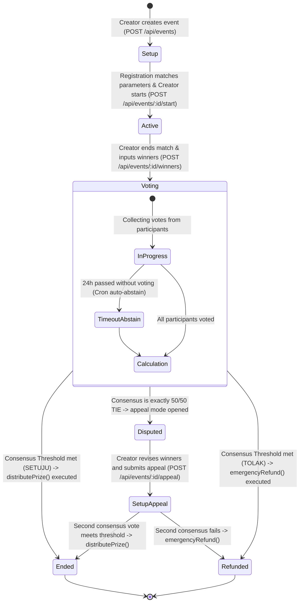

# 🏗️ bitPatch System Architecture

Dokumen ini menjelaskan struktur arsitektur teknis tingkat tinggi (*high-level architecture*) dan detail interaksi komponen pada platform **bitPatch**.

---

## 🗺️ Batas-Batas Sistem (System Boundaries)

bitPatch terdiri dari 4 komponen utama yang saling berinteraksi secara real-time untuk menjamin keamanan dana turnamen dan kelancaran pengalaman pengguna (*user experience*):

```mermaid
graph TB
    subgraph Client ["📱 Client Layer (Mobile-first)"]
        FE["Next.js Web App (8-bit UI)"]
        Wagmi["Wagmi / RainbowKit Light"]
        MiniPay["Opera MiniPay Injected Wallet"]
    end

    subgraph Server ["⚙️ Backend Layer"]
        BE["Express.js Core API"]
        Cron["Node-Cron Scheduler (Auto-Abstain)"]
    end

    subgraph Data ["💾 Storage Layer"]
        DB[(Supabase PostgreSQL)]
    end

    subgraph Chain ["⛓️ Blockchain Layer (Celo)"]
        SC["BitPatchVault.sol (Escrow)"]
        cUSD["cUSD ERC20 Token Contract"]
    end

    FE -->|RPC calls / Wallet connection| MiniPay
    FE -->|REST API Requests| BE
    MiniPay -->|Direct Transaction: register()| SC
    MiniPay -->|Approve allowance| cUSD
    BE -->|Read/Write Queries| DB
    BE -->|Call: distributePrize() / emergencyRefund()| SC
    SC -->|Query state| cUSD
```

### Penjelasan Komponen:
1. **Next.js Frontend:** UI retro 8-bit tanpa panah yang berjalan di browser mobile Opera MiniPay. Menggunakan Wagmi untuk memantau status transaksi deposit langsung dari perangkat mobile peserta.
2. **Express.js API Backend:** Jembatan logika bisnis off-chain. Bertanggung jawab memvalidasi otorisasi juri, mengelola database Supabase, menghitung kuorum suara konsensus, dan mengeksekusi panggilan on-chain ke smart contract menggunakan *admin wallet* terenkripsi.
3. **Supabase PostgreSQL:** Menyimpan data status relasional berkecepatan tinggi yang tidak sensitif terhadap dana (misal: detail event, bagan bracket, rekapan suara, data reputasi anti-troll).
4. **BitPatchVault (Smart Contract Celo):** Bertindak sebagai *escrow* terdesentralisasi buta yang hanya mendengarkan instruksi aman dari dompet admin backend atau transaksi deposit mandiri dari dompet peserta.

---

## 🔄 Diagram Urutan Sekuensial (Core Loop Sequencing)

Berikut adalah diagram alur interaksi terperinci saat turnamen berlangsung, dari pembuatan hingga pendistribusian hadiah:

```mermaid
sequenceDiagram
    autonumber
    actor Creator
    actor Participant
    participant FE as Next.js Frontend (MiniPay)
    participant BE as Express.js Backend
    participant DB as Supabase DB
    participant SC as BitPatchVault.sol

    %% --- PEMBUATAN EVENT ---
    rect rgb(30, 30, 40)
        Note over Creator, DB: Fase 1: Pembuatan Event
        Creator->>FE: Isi Form Pembuatan Event (cUSD, threshold, game mode)
        FE->>BE: POST /api/events (Payload Event Data)
        BE->>SC: call createEvent(eventId, ticketPrice, creatorAddress) via Admin Wallet
        SC-->>BE: EventCreated (Success on-chain)
        BE->>DB: Simpan data event ke tabel 'events' (status: 'setup')
        BE-->>FE: HTTP 201 Created (eventId)
        FE-->>Creator: Tampilan Event berhasil dibuat dengan tema retro
    end

    %% --- PENDAFTARAN PESERTA ---
    rect rgb(30, 45, 30)
        Note over Participant, SC: Fase 2: Pendaftaran Peserta (Deposit)
        Participant->>FE: Klik "Daftar Turnamen"
        FE->>SC: Transaksi cUSD: approve(vault, ticketPrice)
        SC-->>FE: Transaction Success
        FE->>SC: Transaksi register(eventId) via MiniPay
        SC-->>FE: Transaction Success (Dana Terkunci di Vault)
        FE->>BE: POST /api/events/:id/register (TX Hash)
        BE->>DB: Catat peserta di tabel 'participants' (status: 'registered')
        BE-->>FE: HTTP 200 OK
        FE-->>Participant: Tampilan Tiket Turnamen Aktif
    end

    %% --- JALANNYA LAGA ---
    rect rgb(45, 30, 30)
        Note over Creator, BE: Fase 3: Mulai & Selesai Pertandingan Nyata
        Creator->>FE: Klik "Start Event" setelah kuota peserta genap
        FE->>BE: POST /api/events/:id/start
        BE->>DB: Update events status = 'active'
        BE-->>FE: HTTP 200 OK
        Note over Creator, Participant: --- Peserta bermain di dunia riil ---
        Creator->>FE: Klik nama juara & input pemenang (juri)
        FE->>BE: POST /api/events/:id/winners (winnerAddresses, shares)
        BE->>DB: Catat pemenang & ubah status event = 'voting'
        BE-->>FE: HTTP 200 OK
    end

    %% --- KONSENSUS & PENCARIAN DANA ---
    rect rgb(30, 30, 45)
        Note over Participant, SC: Fase 4: Konsensus & Klaim Dana
        Participant->>FE: Berikan suara konsensus (Setuju / Tolak keputusan juri)
        FE->>BE: POST /api/events/:id/vote (is_valid = true/false)
        BE->>DB: Catat suara di tabel 'votes'
        BE-->>FE: HTTP 200 OK
        Note over BE, SC: --- Batas Voting Berakhir (Atau Semua Peserta Telah Vote) ---
        alt Kasus A: Mayoritas Suara (> Threshold) SETUJU
            BE->>SC: call distributePrize(eventId, winners, shares) via Admin Wallet
            SC->>Participant: Transfer cUSD ke dompet pemenang otomatis
            BE->>DB: Update event status = 'ended' & participant status
        else Kasus B: Mayoritas Suara TOLAK (Juri Curang)
            BE->>SC: call emergencyRefund(eventId) via Admin Wallet
            SC->>Participant: Kembalikan tiket cUSD ke semua peserta asal
            BE->>DB: Update event status = 'ended' (refunded)
        end
    end
```

---

## 📊 Transisi State Turnamen (Tournament State Machine)

Setiap event di bitPatch berpindah status secara linier dan aman, dengan mekanisme perlindungan dari macetnya voting:



### Penjelasan Transisi State:
* **`setup`:** Event terdaftar di blockchain & database. Menerima registrasi deposit peserta baru.
* **`active`:** Registrasi ditutup. Turnamen berjalan secara fisik di dunia nyata.
* **`voting`:** Laga selesai. Nama pemenang telah diinput oleh juri. Peserta diberikan waktu 24 jam untuk melakukan pemungutan suara konsensus. Jika peserta tidak memberikan suara dalam 24 jam, sistem cron job secara otomatis menghitungnya sebagai abstain untuk menghindari pembekuan dana turnamen (*state lock*).
* **`disputed`:** Keadaan kritis di mana suara setuju dan tolak berimbang tepat 50/50. Juri diberikan kesempatan mengajukan banding kedua dengan merevisi nama pemenang sebelum dilakukan pemungutan suara ulang.
* **`ended` / `refunded`:** Keadaan akhir mutlak. Dana telah keluar dari *escrow vault* dan disalurkan kembali secara terdesentralisasi (baik ke para pemenang maupun dikembalikan ke seluruh peserta).
