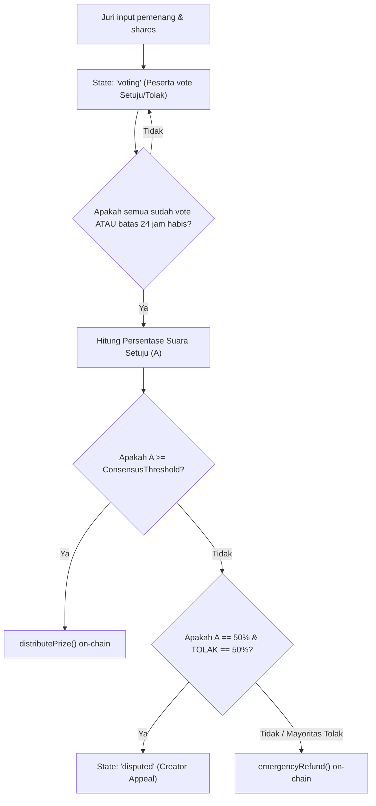

# 🛡️ Consensus & Anti-Troll Engine

Platform **bitPatch** menggabungkan interaksi dunia nyata dengan verifikasi on-chain. Karena juri (Creator) adalah manusia yang berpotensi melakukan bias atau kesalahan input, bitPatch mengandalkan **Mesin Konsensus Demokratis & Sistem Reputasi Anti-Troll** off-chain untuk menjamin keamanan dana secara terdesentralisasi.

---

## 🗳️ Alur Konsensus Demokratis

Setelah turnamen berakhir dan juri menginput nama pemenang, turnamen bergeser ke state `'voting'`. Seluruh peserta terdaftar wajib melakukan pemungutan suara (*voting*) untuk memvalidasi pilihan juri.

### Rumus Perhitungan Kuorum:
* **`ConsensusThreshold`:** Batas persentase minimal suara setuju dari total suara masuk untuk mencairkan dana turnamen (default: **51%**).
* **Persentase Suara Setuju ($P_a$):**
$$P_a = \frac{V_{\text{setuju}}}{V_{\text{setuju}} + V_{\text{tolak}}} \times 100\%$$
* Jika $P_a \ge \text{ConsensusThreshold}$ $\rightarrow$ Hasil sah, dana ditransfer ke para pemenang.
* Jika $P_a < \text{ConsensusThreshold}$ $\rightarrow$ Hasil tidak sah, dana dikembalikan penuh ke semua dompet peserta asal (*emergency refund*).

---

## 🕰️ Batas Waktu & Penanganan Abstain (24h Auto-Abstain)

Salah satu risiko terbesar platform Social-Fi adalah **dana tersangkut (*state lock*)** karena ada peserta pasif yang malas atau lupa melakukan voting.

* **Mitigasi Batas Waktu 24 Jam:** Peserta diberikan waktu maksimal **24 jam** sejak nama pemenang disubmit untuk memberikan suaranya.
* **Cron Job Auto-Abstain:** Backend Express.js menjalankan *cron job* terjadwal setiap 10 menit. Jika 24 jam telah berlalu dan ada peserta yang belum memberikan suara, status suara mereka otomatis diubah menjadi `abstain`.
* **Dampak Abstain:** Peserta yang abstain **dikeluarkan dari pembagi kuorum**. Persentase persetujuan dihitung murni hanya dari total suara aktif yang masuk.
  - *Contoh:* Turnamen diikuti oleh 10 peserta. 4 peserta vote Setuju, 2 peserta vote Tolak, dan 4 peserta abstain. Total suara aktif = 6. Rasio persetujuan = $4/6 = 66.6\%$. Karena $66.6\% \ge 51\%$, konsensus dinyatakan **SETUJU** dan dana dicairkan.

---

## ⚖️ Penanganan Situasi Seimbang 50/50 (*Tie Dispute*)

Jika hasil voting berakhir dengan angka berimbang sempurna (tepat **50% Setuju** dan **50% Tolak**), sistem tidak langsung melakukan refund melainkan masuk ke status sengketa (`disputed`).

1. **State Disputed:** Tombol "Ajukan Banding Kedua" (*Second Appeal*) terbuka khusus di halaman antarmuka Creator.
2. **Revisi Pemenang:** Creator diberikan kesempatan satu kali untuk merevisi daftar pemenang atau proporsi pembagian hadiah (*shares*), lalu menyubmitnya kembali.
3. **Voting Putaran Kedua:** Seluruh suara peserta direset ke nol, dan voting putaran kedua dibuka selama 12 jam tambahan.
4. **Resolusi Akhir:** Jika pada putaran kedua konsensus kembali gagal mencapai threshold atau berimbang kembali, sistem backend akan **secara otomatis memaksa** eksekusi fungsi `emergencyRefund()` di smart contract guna menjamin dana peserta tidak tertahan selamanya di vault.

---

## 🚫 Sistem Reputasi Anti-Troll (Minority Penalty)

Untuk mencegah adanya peserta iseng yang selalu memberikan suara "Tolak" secara sengaja di setiap turnamen (*griefing/trolling*), bitPatch menerapkan sistem **Minority Penalty**:

### 1. Deteksi Pola Trolling
Jika hasil akhir voting suatu turnamen menghasilkan konsensus yang sangat bulat yaitu **$\ge 85\%$ suara menyetujui** keputusan juri, maka sistem backend mendeteksi bahwa sisa kelompok kecil **$\le 15\%$ suara menolak** terindikasi melakukan aksi *trolling*.

### 2. Pengurangan Skor Reputasi
Alamat dompet kelompok minoritas tersebut dicatat ke tabel database `reputation_tracking` dan skor reputasi mereka dikurangi secara matematis:
$$\text{Reputation Score}_{\text{baru}} = \text{Reputation Score}_{\text{lama}} - (\text{minority\_votes} \times 15)$$

### 3. Efek Hukuman (Penalties)
* **Status Normal (80 - 100):** Akses penuh ke seluruh fitur platform.
* **Status Warning (50 - 79):** Nilai bobot suara voting mereka di turnamen berikutnya dikurangi sebesar 50%.
* **Status Banned (< 50):** Dompet otomatis diblokir dari mendaftar turnamen bertipe *Private Campaign* dan bobot suara mereka dihitung 0% (tidak memengaruhi kuorum turnamen publik).
