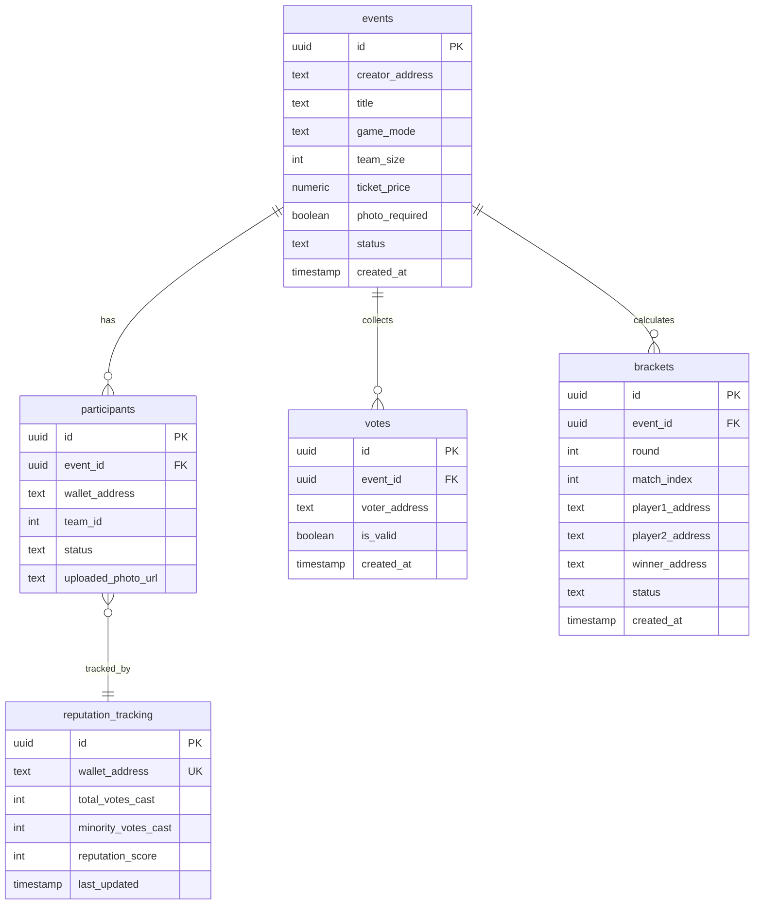

# 💾 Database Schema Guide: Supabase PostgreSQL

Dokumen ini menyediakan spesifikasi teknis dan skema database relasional **PostgreSQL** yang dihosting pada **Supabase** untuk mendukung logika off-chain platform **bitPatch**.

---

## 📐 Arsitektur Tabel Relasional

Sistem ini didesain menggunakan 5 tabel utama untuk melacak turnamen, pendaftaran peserta, pencatatan hasil bagan/bracket, pemungutan suara konsensus, dan reputasi anti-troll:



---

## 🗂️ Detail Spesifikasi Tabel

### 1. Tabel `events`
Menyimpan informasi utama dan konfigurasi aturan main setiap event turnamen.
* **`id`**: `UUID` (PRIMARY KEY) - Generated otomatis via `gen_random_uuid()`.
* **`creator_address`**: `TEXT` (NOT NULL) - Alamat wallet Creator pembuat turnamen.
* **`title`**: `TEXT` (NOT NULL) - Judul atau nama turnamen.
* **`game_mode`**: `TEXT` (NOT NULL) - Mode tanding. Nilai valid: `'1v1'`, `'team'`, atau `'ffa'`.
* **`team_size`**: `INT` (DEFAULT `1`) - Jumlah anggota per tim (hanya berlaku jika `game_mode` = `'team'`).
* **`ticket_price`**: `NUMERIC` (NOT NULL) - Harga tiket masuk turnamen dalam cUSD.
* **`photo_required`**: `BOOLEAN` (DEFAULT `false`) - Jika `true`, pemenang wajib mengunggah bukti foto sebelum juri menginput skor.
* **`status`**: `TEXT` (DEFAULT `'setup'`) - Siklus hidup event. State yang valid: `'setup'`, `'active'`, `'voting'`, `'disputed'`, `'ended'`.
* **`created_at`**: `TIMESTAMP` (DEFAULT `NOW()`).

### 2. Tabel `participants`
Mencatat alamat dompet peserta yang mendepositkan cUSD dan status mereka di turnamen.
* **`id`**: `UUID` (PRIMARY KEY).
* **`event_id`**: `UUID` (FOREIGN KEY REFERENCES `events(id)` ON DELETE CASCADE).
* **`wallet_address`**: `TEXT` (NOT NULL) - Alamat wallet peserta.
* **`team_id`**: `INT` (NULLABLE) - Identifikasi tim acak atau tim terdaftar.
* **`status`**: `TEXT` (DEFAULT `'registered'`) - Status keaktifan tanding. State: `'registered'`, `'eliminated'`, `'winner'`.
* **`uploaded_photo_url`**: `TEXT` (NULLABLE) - URL penyimpanan file foto bukti jika `photo_required` bernilai `true`.

### 3. Tabel `votes`
Menampung riwayat suara yang diberikan peserta pada tahap konsensus juri.
* **`id`**: `UUID` (PRIMARY KEY).
* **`event_id`**: `UUID` (FOREIGN KEY REFERENCES `events(id)` ON DELETE CASCADE).
* **`voter_address`**: `TEXT` (NOT NULL) - Dompet peserta yang memberikan suara.
* **`is_valid`**: `BOOLEAN` (NOT NULL) - `true` jika setuju pemenang pilihan juri, `false` jika juri dianggap curang.
* **`created_at`**: `TIMESTAMP` (DEFAULT `NOW()`).

### 4. Tabel `brackets`
Mengelola detail bagan tanding per babak untuk mode turnamen eliminasi (`1v1` & `team`).
* **`id`**: `UUID` (PRIMARY KEY).
* **`event_id`**: `UUID` (FOREIGN KEY REFERENCES `events(id)` ON DELETE CASCADE).
* **`round`**: `INT` (NOT NULL) - Angka babak pertandingan (misal: 1 = Babak 1, 2 = Semifinal, 3 = Final).
* **`match_index`**: `INT` (NOT NULL) - Urutan kotak tanding dalam babak tersebut.
* **`player1_address`**: `TEXT` (NULLABLE) - Alamat wallet atau nama representasi tim pertama.
* **`player2_address`**: `TEXT` (NULLABLE) - Alamat wallet atau nama representasi tim kedua.
* **`winner_address`**: `TEXT` (NULLABLE) - Pemenang yang ditunjuk juri untuk melaju ke babak berikutnya.
* **`status`**: `TEXT` (DEFAULT `'pending'`) - Status kotak tanding. State: `'pending'`, `'active'`, `'completed'`.

### 5. Tabel `reputation_tracking`
Mengawasi track record perilaku peserta turnamen guna menghukum troll bermotif jahat.
* **`id`**: `UUID` (PRIMARY KEY).
* **`wallet_address`**: `TEXT` (UNIQUE, NOT NULL) - Wallet peserta yang diawasi.
* **`total_votes_cast`**: `INT` (DEFAULT `0`) - Total suara konsensus yang pernah disubmit di berbagai turnamen.
* **`minority_votes_cast`**: `INT` (DEFAULT `0`) - Akumulasi suara minoritas yang terbukti melenceng dari kesepakatan massal (>85%).
* **`reputation_score`**: `INT` (DEFAULT `100`) - Skor reputasi (0-100). Semakin sering trolling, nilai akan anjlok.
* **`last_updated`**: `TIMESTAMP` (DEFAULT `NOW()`).

---

## 📝 Script DDL SQL Lengkap (Supabase Ready)

Developer dapat menyalin script SQL berikut untuk di-run langsung di bagian **SQL Editor** pada Dashboard Supabase Anda guna menginisiasi tabel secara otomatis:

```sql
-- Aktifkan ekstensi uuid jika belum ada
CREATE EXTENSION IF NOT EXISTS "uuid-ossp";

-- 1. Membuat Tabel Events
CREATE TABLE IF NOT EXISTS events (
    id UUID PRIMARY KEY DEFAULT gen_random_uuid(),
    creator_address TEXT NOT NULL,
    title TEXT NOT NULL,
    game_mode TEXT NOT NULL CHECK (game_mode IN ('1v1', 'team', 'ffa')),
    team_size INT DEFAULT 1,
    ticket_price NUMERIC NOT NULL CHECK (ticket_price >= 0),
    photo_required BOOLEAN DEFAULT false,
    status TEXT DEFAULT 'setup' CHECK (status IN ('setup', 'active', 'voting', 'disputed', 'ended')),
    created_at TIMESTAMP DEFAULT NOW()
);

-- 2. Membuat Tabel Participants
CREATE TABLE IF NOT EXISTS participants (
    id UUID PRIMARY KEY DEFAULT gen_random_uuid(),
    event_id UUID REFERENCES events(id) ON DELETE CASCADE,
    wallet_address TEXT NOT NULL,
    team_id INT DEFAULT NULL,
    status TEXT DEFAULT 'registered' CHECK (status IN ('registered', 'eliminated', 'winner')),
    uploaded_photo_url TEXT,
    CONSTRAINT unique_participant_per_event UNIQUE (event_id, wallet_address)
);

-- 3. Membuat Tabel Votes
CREATE TABLE IF NOT EXISTS votes (
    id UUID PRIMARY KEY DEFAULT gen_random_uuid(),
    event_id UUID REFERENCES events(id) ON DELETE CASCADE,
    voter_address TEXT NOT NULL,
    is_valid BOOLEAN NOT NULL,
    created_at TIMESTAMP DEFAULT NOW(),
    CONSTRAINT unique_vote_per_participant UNIQUE (event_id, voter_address)
);

-- 4. Membuat Tabel Brackets
CREATE TABLE IF NOT EXISTS brackets (
    id UUID PRIMARY KEY DEFAULT gen_random_uuid(),
    event_id UUID REFERENCES events(id) ON DELETE CASCADE,
    round INT NOT NULL CHECK (round > 0),
    match_index INT NOT NULL CHECK (match_index >= 0),
    player1_address TEXT,
    player2_address TEXT,
    winner_address TEXT,
    status TEXT DEFAULT 'pending' CHECK (status IN ('pending', 'active', 'completed')),
    created_at TIMESTAMP DEFAULT NOW()
);

-- 5. Membuat Tabel Reputation Tracking
CREATE TABLE IF NOT EXISTS reputation_tracking (
    id UUID PRIMARY KEY DEFAULT gen_random_uuid(),
    wallet_address TEXT UNIQUE NOT NULL,
    total_votes_cast INT DEFAULT 0 CHECK (total_votes_cast >= 0),
    minority_votes_cast INT DEFAULT 0 CHECK (minority_votes_cast >= 0),
    reputation_score INT DEFAULT 100 CHECK (reputation_score BETWEEN 0 AND 100),
    last_updated TIMESTAMP DEFAULT NOW()
);

-- 6. Optimasi Indexing untuk Kecepatan Query
CREATE INDEX IF NOT EXISTS idx_participants_event ON participants(event_id);
CREATE INDEX IF NOT EXISTS idx_votes_event ON votes(event_id);
CREATE INDEX IF NOT EXISTS idx_brackets_event ON brackets(event_id);
CREATE INDEX IF NOT EXISTS idx_reputation_wallet ON reputation_tracking(wallet_address);
```
