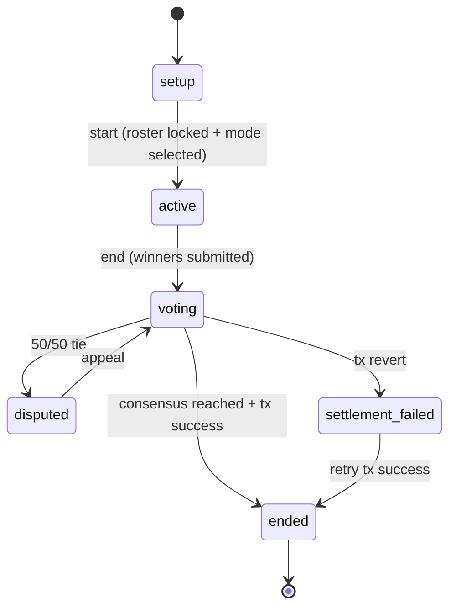

## Context

Repo memiliki 4 file dokumentasi root (README, PROJECT_OVERVIEW, FIX_PLAN,
TESTING, AUDIT) + folder `docs/` yang hanya berisi README index dengan
semua link "(belum tersedia)". Hackathon reviewer + onboarding contributor
butuh dokumentasi minimum yang:

- Menjelaskan arsitektur cepat (gambar > 1000 kata).
- Memberikan referensi yang dapat dirujuk saat membaca kode.
- Sinkron dengan apa yang ada di kode + openspec/specs/.

Karena openspec/specs/ sudah berisi requirement formal yang kanonik, dokumen
di `docs/` adalah **narrative companion** — boleh ringkas dan link ke spec
untuk detail formal.

## Goals / Non-Goals

**Goals:**
- 3 dokumen tinggi-impact (ARCHITECTURE, SMART-CONTRACT, API) ditulis &
  sinkron dengan kode aktual.
- Diagram Mermaid yang render di GitHub.
- Cross-link ke openspec spec yang relevan untuk requirement formal.
- README index bersih dari placeholder yang salah.

**Non-Goals:**
- Menulis 4 dokumen lain (DATABASE / GAME-MODES / CONSENSUS / SETUP) penuh
  sekarang — sketsa dulu, lengkap follow-up.
- Auto-generate API docs (mis. OpenAPI / JSDoc → docs). Tetap manual untuk
  hackathon.

## Decisions

### D1: 3 dokumen prioritas, sisanya sketsa
Implementasi tugas 2-4 fokus pada ARCHITECTURE / SMART-CONTRACT / API.
DATABASE / GAME-MODES / CONSENSUS / SETUP cukup di-stub dengan h1 + 1
paragraph + "TODO: full reference" → memberi struktur untuk follow-up
tanpa membohongi reader.

### D2: Mermaid untuk diagram
Mermaid native ter-render di GitHub. Tidak butuh tooling tambahan.

State machine event:


### D3: SMART-CONTRACT.md mencerminkan rename USDC
Tunggu change `contract-naming-and-blacklist-docs` landed dulu agar identifier
`usdc` sudah benar. Atau: tulis dokumen ini **setelah** change tersebut
landed, dan tandai di tasks dependensi.

### D4: API.md mengikuti kode existing, bukan idealisasi
Tulis sesuai endpoint nyata di [backend/routes/events.js](../../../backend/routes/events.js)
+ `reputation.js` + `socialConnect.js`. Bila ada endpoint yang akan dihapus
(mis. `/leaderboard/reputation` di change `backend-correctness-cleanup`),
TIDAK didokumentasikan — sinkron dengan state pasca semua change landed.

### D5: Format konsisten per endpoint
Untuk tiap endpoint di API.md:
```md
### POST /api/events/:id/register

Register peserta + verifikasi deposit on-chain.

**Body**
| Field | Type | Required | Notes |
|---|---|---|---|
| wallet_address | string | yes | EOA address (0x...) |
| tx_hash | string | yes | Hash transaksi register on-chain |
| password | string | no | Hanya untuk access_type = password |

**Responses**
| Status | Meaning |
|---|---|
| 201 | Participant row created |
| 400 | Bad request or chain verification failed |
| 403 | Creator self-register / failed password / reputation gate |
| 409 | Already registered |
```

### D6: SMART-CONTRACT.md menyertakan ABI snippet
Untuk tiap fungsi, sertakan signature Solidity + parameter description +
emitted event + revert reasons. Reference ke
`contracts/src/BitPactVault.sol` untuk source-of-truth.

## Risks / Trade-offs

- **Drift documentation**: dokumentasi tertulis tangan akan drift dari kode.
  Mitigasi: link ke file kode aktual (relative path) di setiap section
  utama agar reviewer dapat verifikasi cepat.
- **Ordering dengan change lain**: ARCHITECTURE.md dan SMART-CONTRACT.md
  sebaiknya menunggu change `contract-naming-and-blacklist-docs` landed
  agar identifier `usdc` sudah konsisten. Tetapkan dependency di tasks.

## Migration Plan

1. Tulis ARCHITECTURE.md (independent dari change lain).
2. Tunggu `contract-naming-and-blacklist-docs` landed, lalu tulis
   SMART-CONTRACT.md.
3. Tunggu `backend-correctness-cleanup` landed (untuk hilangnya leaderboard
   endpoint), lalu tulis API.md.
4. Update `docs/README.md` (hapus placeholder untuk 3 dokumen aktif).
5. Sketsa 4 dokumen sisanya (h1 + TODO).

Rollback: revert PR; tidak ada dampak operasional.

## Open Questions

- Apakah perlu sequence diagram terpisah per flow (register/vote/settle) di
  ARCHITECTURE.md atau cukup state machine + komponen overview? **Untuk
  hackathon**: state machine + komponen overview saja cukup. Sequence
  diagram opsional, tambah bila waktu memungkinkan.
